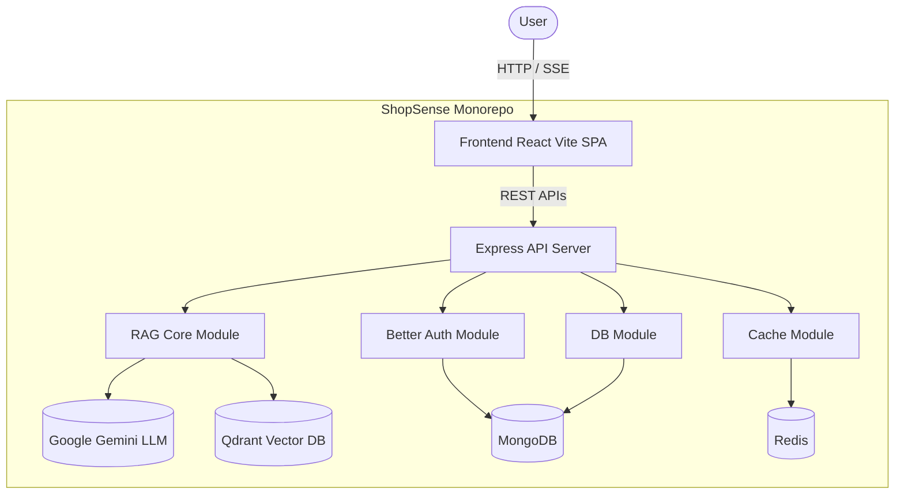

<div align="center">
  
  
  # ShopSense 🛍️✨
  
  **AI-Powered Conversational Product Advisor**

  <p>
    <a href="https://github.com/microsoft/TypeScript"></a>
    <a href="https://react.dev/"></a>
    <a href="https://expressjs.com/"></a>
    <a href="https://qdrant.tech/"></a>
    <a href="https://www.better-auth.com/"></a>
  </p>
  
  *ShopSense is a next-generation shopping assistant for the Indian e-commerce market. Users describe what they want in plain English, and receive semantically ranked products with a powerful RAG-backed chat layer for follow-up questions.*
</div>

---

## 🌟 Key Features

- **Semantic Search** — Powered by `text-embedding-004` and Qdrant vector store.
- **RAG Chat Layer** — Ask follow-up questions, compare specs, or clarify requirements via a streaming SSE LLM chat powered by Gemini.
- **Dynamic Frontend** — A stunning glassmorphic UI built with React + Vite and modern vanilla CSS.
- **Robust Auth** — Powered by [Better Auth](https://better-auth.com/) (Email/Password + Google OAuth) with secure HttpOnly cookies.
- **Monorepo Architecture** — Scalable workspaces separating core logic, database access, caching, and frontend/backend apps.

---

## 🏗️ Architecture



### 📦 Workspace Structure

```text
shopsense/
├── apps/
│   ├── api/                    # Backend server
│   │   ├── src/
│   │   │   ├── lib/auth.ts     # Better Auth configuration
│   │   │   ├── middleware/     # Auth & Rate Limiting guards
│   │   │   ├── routes/         # Express API routes
│   │   │   └── index.ts        # API entry point (Port 3001)
│   │   └── package.json
│   │
│   └── web/                    # Frontend React SPA
│       ├── src/
│       │   ├── components/     # UI Components (Chat, Products, Auth)
│       │   ├── context/        # React Context (AuthContext, ChatContext)
│       │   ├── lib/            # API & SSE clients, Formatters, Types
│       │   ├── App.tsx         # Routing & Layout
│       │   └── index.css       # Design System & Styling
│       └── package.json
│
├── packages/
│   ├── cache/                  # Redis caching & rate limit utilities
│   ├── db/                     # Mongoose Schemas (Product, Session, ChatTurn)
│   └── rag-core/               # LangChain, Chunking, Embeddings pipeline
│
└── infra/
    └── docker-compose.yml      # Local services (Redis, MongoDB, Qdrant)
```

---

## 🚀 Getting Started

### Prerequisites

- **Node.js** ≥ 18
- **MongoDB** (Atlas or local)
- **Redis** & **Qdrant** (can use Docker or cloud instances)
- **Google API Key** for Gemini models. [Get one free](https://aistudio.google.com/apikey).

### Installation

1. **Clone the repository:**
   ```bash
   git clone https://github.com/yourusername/shopsense.git
   cd shopsense
   ```

2. **Install dependencies:**
   ```bash
   npm install
   ```

3. **Configure Environment Variables:**
   ```bash
   cp .env.example .env
   ```
   Open `.env` and fill out your keys:
   ```env
   # LLMs
   GOOGLE_API_KEY=your_gemini_api_key
   GROQ_API_KEY=your_groq_api_key

   # Databases
   MONGODB_URI=mongodb+srv://...
   REDIS_URL=redis://localhost:6379
   QDRANT_URL=https://...
   QDRANT_API_KEY=your_qdrant_key

   # Authentication
   BETTER_AUTH_SECRET=generate_using_openssl_rand_base64_32
   BETTER_AUTH_URL=http://localhost:3001
   FRONTEND_URL=http://localhost:5173
   GOOGLE_CLIENT_ID=your_oauth_client_id
   GOOGLE_CLIENT_SECRET=your_oauth_secret
   ```

4. **Build the packages:**
   ```bash
   npm run build
   ```

5. **Start the development servers:**
   Open two terminal windows:
   ```bash
   # Terminal 1: Start the API server (Port 3001)
   npm run dev:api
   
   # Terminal 2: Start the Web frontend (Port 5173)
   npm run dev:web
   ```

---

## 🔌 API Endpoints

| Method | Endpoint | Description | Protected? |
|--------|---------|-------------|------------|
| `GET` | `/api/health` | Service health check | ❌ |
| `POST` | `/api/auth/*` | Better Auth endpoints | ❌ |
| `POST` | `/api/chat` | Send a message to RAG stream (SSE) | ✅ |
| `GET` | `/api/products` | Semantic product search | ✅ |
| `POST` | `/api/sessions` | Create a new chat session | ✅ |
| `GET` | `/api/sessions/:id` | Fetch chat history | ✅ |

---

## 💡 The RAG Pipeline Workflow

1. **Intent Detection:** Categorizes user query into `new_search`, `follow_up`, `comparison`, or `clarification`.
2. **Chunking & Embedding:** Splits product metadata, specs, and reviews. Embeds using Gemini `text-embedding-004`.
3. **Vector Search:** Queries Qdrant using Cosine similarity.
4. **Generation:** Passes retrieved context to the LLM.
5. **Streaming:** Streams tokens directly to the React frontend using Server-Sent Events (SSE).

---

<div align="center">
  <i>Built with ❤️ for AI-assisted shopping.</i>
</div>
